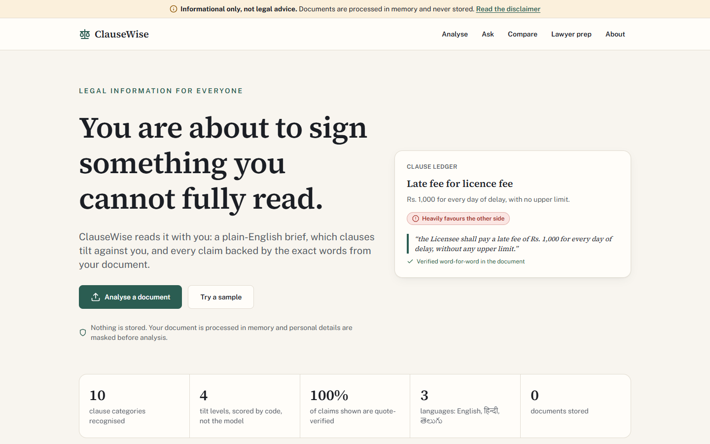
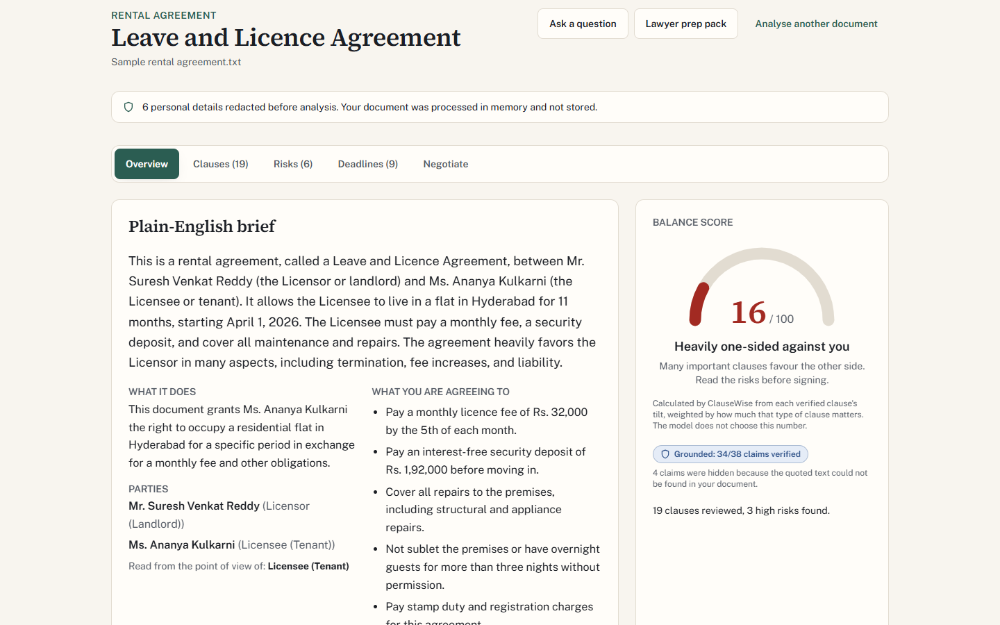
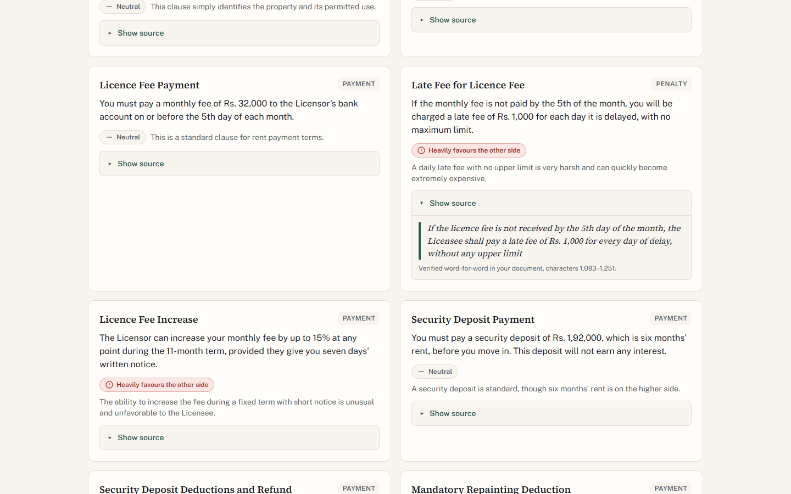
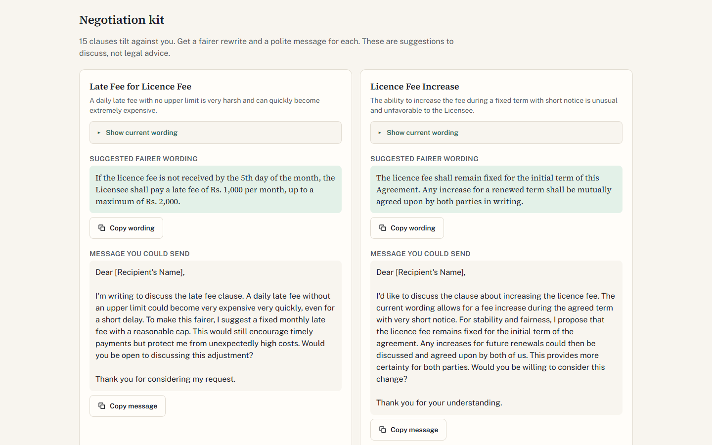

# ClauseWise

**Know what you're signing.** ClauseWise reads a rental agreement, job offer, NDA, loan paper or
service contract and explains it in plain English, shows which clauses tilt against you, and
prepares you to negotiate or to walk into a lawyer's office ready. Every claim it makes is backed
by a quote that is verified, word for word, against your document.

**Live demo:** https://clausewise-lovat.vercel.app

[](https://github.com/vedant7007/clausewise/actions/workflows/ci.yml)
[](LICENSE)

> ClauseWise provides legal **information**, not legal advice. See the [full disclaimer](#legal-disclaimer).

---

## The problem

Priya has just been offered a flat in Hyderabad. The owner sends a nine-page "leave and licence
agreement" on WhatsApp and wants it signed by tonight. Buried in clause 4 is a six-month deposit
that he may keep "in his sole discretion"; clause 8 lets him evict her on fifteen days' notice while
she is locked in for six months; clause 3 lets him raise the rent 15% with a week's warning.

Priya is not careless. She simply cannot afford ₹3,000 for a lawyer to read every agreement put in
front of her, and she does not have the vocabulary to know which of these clauses are normal. Most
people sign rental agreements, job offers, NDAs and loan papers exactly like this: under time
pressure, without advice, and without knowing what they gave away until it costs them.

## The solution

ClauseWise gives that first read to anyone, for free, in minutes, in English, Hindi or Telugu.

What makes it different from pasting a contract into a chatbot:

| Differentiator                     | What it means                                                                                                                                                                                                                                                                                                                                                                             |
| ---------------------------------- | ----------------------------------------------------------------------------------------------------------------------------------------------------------------------------------------------------------------------------------------------------------------------------------------------------------------------------------------------------------------------------------------- |
| **Clause Ledger and Tilt Meter**   | Every material clause is labelled as favouring you, neutral, favouring the other side, or heavily favouring the other side, with a one-line reason. A **balance score from 0 to 100** is then computed **deterministically in TypeScript** from those labels and category weights. The model never picks the number.                                                                      |
| **Verified evidence anchoring**    | The model must quote the document for every clause, risk, deadline and answer. A deterministic verifier checks each quote is an exact substring of your document (ignoring only case, whitespace and curly quotes). Anything it cannot find is **dropped and counted**, and the UI shows "Grounded: N/M claims verified" plus a "Show source" disclosure with the exact character offset. |
| **PII redaction before inference** | Emails, phone numbers, Aadhaar-like and PAN-like numbers and long account-style digit runs are masked **before** text leaves the server, then restored in the output. The user sees "N personal details redacted before analysis".                                                                                                                                                        |
| **Negotiation Kit**                | For each unfair clause: a fairer rewrite and a short, polite, ready-to-send message, each with copy to clipboard.                                                                                                                                                                                                                                                                         |
| **Offline-safe demo**              | If the model is unavailable (quota, auth, network), the bundled samples fall back to saved analyses produced by the same pipeline, with a clear notice. Fixtures are never used for user uploads and never presented as live.                                                                                                                                                             |

## Screenshots

|                                                                                       |                                                                                                       |
| ------------------------------------------------------------------------------------- | ----------------------------------------------------------------------------------------------------- |
|                         |  |
| **Landing page.** Try a sample or upload your own document.                           | **Overview.** Plain-English brief, balance score and verification badge.                              |
|  |    |
| **Clause ledger.** Tilt per clause, with the exact source quote and offset.           | **Negotiation kit.** Fairer wording and a polite message, ready to copy.                              |

## Feature walkthrough

### 1. Plain-English brief

An executive summary at roughly an 8th-grade reading level, the parties and their roles, what the
document does, five bullets on what you are agreeing to, and the detected document type (rental,
employment, NDA, loan, service or other).

### 2. Clause Ledger and Tilt Meter

Each clause card shows its title, category (termination, payment, liability, confidentiality,
renewal, jurisdiction, indemnity, penalty, notice, other), a plain meaning and a tilt with its
reason. The balance score is a category-weighted average of tilt points
([`clause-weights.ts`](src/lib/analysis/clause-weights.ts),
[`balance-score.ts`](src/lib/analysis/balance-score.ts)), shown as an accessible `meter` with a
number and a text verdict, never colour alone.

### 3. Verified evidence anchoring

[`evidence-verifier.ts`](src/lib/analysis/evidence-verifier.ts) normalises the source once, maps
every normalised character back to its original offset, and accepts a quote only if it is a
contiguous substring of at least 8 characters. Paraphrases, partial overlaps and invented text are
rejected. The verified span shown to the user is taken from **your document**, not from the model.

### 4. Risk Radar

Risks are rated HIGH, MEDIUM, LOW or INFO and sorted by severity. Each explains what the clause
says, what could realistically go wrong, who it hurts and a practical next step. Severity is
conveyed by a text label, an icon and colour together.

### 5. Obligations and deadline timeline

Who must do what, by when, and the consequence of missing it. Relative deadlines ("within 30 days of
termination") stay in the document's words; calendar dates are parsed. Export the dated deadlines
as an **.ics** file, hand-written client-side with CRLF line endings, RFC 5545 escaping and line
folding ([`ics.ts`](src/lib/export/ics.ts)), or everything as a Markdown checklist.

### 6. Compare mode

Compare two versions of a document, or compare your document with a bundled **fair baseline** for
rental, employment or NDA ([`src/data/baselines`](src/data/baselines)). Differences are classified
ADDED, REMOVED or MODIFIED, rated HIGH, MEDIUM or LOW, and explained as "what this change means for
you". A difference is kept only if every quote it cites is found in the matching document.

### 7. Grounded Q&A

Answers come only from the document, with verified supporting quotes and a HIGH, MEDIUM or LOW
confidence. If the document is silent, ClauseWise says so. Questions such as "should I sue?" or
"will I win?" are declined politely with the relevant clauses and a pointer to a lawyer or legal
aid. An answer that claims support but has no verifiable quote is downgraded to LOW confidence.

### 8. Negotiation Kit

Generated on demand for every clause that tilts against you: a balanced rewrite and a 60 to 120
word message you can send as is.

### 9. Lawyer Prep Pack

The most important questions to ask a lawyer, gaps in the document, documents to bring, key risks
and a one-page neutral case summary. Download it as Markdown or print it; a dedicated `@media print`
stylesheet produces a clean handout.

### Inclusion and safety

- **Languages:** English, Hindi and Telugu output; legal terms keep the English word in brackets
  on first use. **Plain-language mode** rewrites explanations at a simpler reading level, and a
  finished analysis can be re-explained without re-uploading.
- **Safety:** a persistent "Informational only, not legal advice" banner, a first-run notice, a
  full [/disclaimer](https://clausewise-lovat.vercel.app/disclaimer) page, PII redaction, prompt
  injection defence, and no document storage.

## Architecture

```
 Browser (React, App Router)                         Server (Next.js route handlers, Node.js)
 ┌──────────────────────────────┐   multipart /    ┌──────────────────────────────────────────────┐
 │ /analyze  /ask  /compare     │   JSON           │ route.ts (thin)                                │
 │ /prep     /disclaimer        │ ───────────────▶ │  rate limit ─▶ validate (Zod) ─▶ service       │
 │                              │                  │                                                │
 │ SessionProvider (memory only)│ ◀─────────────── │ services/                                      │
 │ NDJSON stage reader          │  NDJSON stream   │  parse ─▶ redact PII ─▶ count injections ─▶     │
 │ .ics / .md export (client)   │  or JSON         │  bound context ─▶ AIManager ─▶ Zod safeParse ─▶ │
 └──────────────────────────────┘                  │  restore PII ─▶ verify quotes ─▶ score balance │
                                                   │                                                │
                                                   │ AIManager: 25s idle timeout, 90s cap, 2 retries │
                                                   │  with backoff + jitter, model fallback chain,  │
                                                   │  one schema-repair attempt, typed AppError     │
                                                   └───────────────┬──────────────────────────────┘
                                                                   │ fenced, redacted text
                                                    ┌──────────────▼──────────────┐
                                                    │ Gemini (primary + fallbacks) │
                                                    │ Groq (optional fallback)     │
                                                    └──────────────────────────────┘
```

**Request lifecycle for an analysis** ([`analyze-request.ts`](src/lib/services/analyze-request.ts),
[`analyze-service.ts`](src/lib/services/analyze-service.ts)):

1. `POST /api/analyze` checks the per-IP rate limit, validates the form, and confirms a provider is configured.
2. The response becomes an NDJSON stream. **parsing**: the upload is checked for size, extension, MIME type and magic bytes, then text is extracted.
3. **redacting**: PII is masked with a reversible token map; injection phrases are counted; long text is bounded by keeping the head and tail with a marked gap.
4. **analyzing**: one consolidated, schema-constrained model call returns the brief, clauses, risks, obligations and prep pack.
5. **verifying**: output is validated with Zod, PII is restored, every quote is verified against the original text, unverified items are dropped, risks are sorted and the balance score is computed.
6. The result streams to the browser, which keeps it in memory only.

See [docs/ARCHITECTURE.md](docs/ARCHITECTURE.md) for the full design.

## GenAI services used and where

All calls go through [`AIManager`](src/lib/ai/ai-manager.ts), which sends a structural JSON Schema
generated from the Zod output schema and validates every response with `safeParse`.

| Provider and model                                                                               | Role                                                                         | Feature it powers                                                                   | Files                                                                                                                            |
| ------------------------------------------------------------------------------------------------ | ---------------------------------------------------------------------------- | ----------------------------------------------------------------------------------- | -------------------------------------------------------------------------------------------------------------------------------- |
| Google Gemini **`gemini-2.5-flash`** (via `@google/genai`, JSON mode, streamed)                  | Primary model (`GEMINI_MODEL`)                                               | Brief, clause ledger, risks, obligations and prep pack in **one** consolidated call | [`prompts/analyze.ts`](src/lib/prompts/analyze.ts), [`services/analyze-service.ts`](src/lib/services/analyze-service.ts)         |
| Same                                                                                             | Primary model                                                                | Grounded Q&A                                                                        | [`prompts/ask.ts`](src/lib/prompts/ask.ts), [`services/ask-service.ts`](src/lib/services/ask-service.ts)                         |
| Same                                                                                             | Primary model                                                                | Compare mode and fair-baseline comparison                                           | [`prompts/compare.ts`](src/lib/prompts/compare.ts), [`services/compare-service.ts`](src/lib/services/compare-service.ts)         |
| Same                                                                                             | Primary model                                                                | Negotiation Kit                                                                     | [`prompts/negotiate.ts`](src/lib/prompts/negotiate.ts), [`services/negotiate-service.ts`](src/lib/services/negotiate-service.ts) |
| Gemini **`gemini-3-flash-preview`**, **`gemini-3.1-flash-lite`**, **`gemini-flash-lite-latest`** | Fallback chain (`GEMINI_FALLBACK_MODELS`), each with its own free-tier quota | All of the above, when the primary is out of quota or unavailable                   | [`ai/index.ts`](src/lib/ai/index.ts), [`ai/gemini-provider.ts`](src/lib/ai/gemini-provider.ts)                                   |
| Groq **`openai/gpt-oss-120b`** (`GROQ_MODEL`; structured outputs, `GROQ_REASONING_EFFORT=low`)   | Final fallback, enabled only when `GROQ_API_KEY` is set                      | All of the above, when every Gemini model is unavailable                            | [`ai/groq-provider.ts`](src/lib/ai/groq-provider.ts)                                                                             |

The primary model was verified against the deployment key during setup: it lists as available and
returns schema-constrained JSON. What the model **does not** do: compute the balance score, decide
whether a quote is real, choose what personal data to hide, or sort risks. Those are deterministic
TypeScript.

### Reliability and quota handling

Free model tiers run out, and a legal tool that fails at the moment someone needs it is not
accessible. ClauseWise is engineered to degrade in steps rather than fall over:

1. **Resilient calls.** Every call has a 25 s idle timeout and a 90 s cap. Rate limits, timeouts and
   5xx errors are retried twice with exponential backoff and jitter; auth errors and spent daily
   quotas skip straight to the next provider.
2. **Per-model Gemini fallbacks.** The primary is `gemini-2.5-flash`. Gemini free-tier quotas are
   counted per model, so `GEMINI_FALLBACK_MODELS` chains `gemini-3-flash-preview`,
   `gemini-3.1-flash-lite` and `gemini-flash-lite-latest`, each with its own allowance.
3. **Groq `openai/gpt-oss-120b` as the final, independent fallback.** A different vendor on different infrastructure,
   called with structured outputs and an explicit completion budget sized to fit its free tier.
4. **Same standard, whoever answers.** Every provider's output passes the same Zod validation, PII
   restoration and quote verification, so a fallback answer is never less grounded.
5. **Sample safety net.** If every provider is unavailable, the bundled samples show a saved
   analysis from the same pipeline, clearly labelled. User documents never fall back to fixtures.

Each failure and each fallback-served request is logged server-side with its provider and model,
and never exposed to the client. **Verified on a live deployment:** with Gemini forced into a real
quota error (HTTP 429, free-tier daily limit), a pasted employment offer was analysed live by the
Groq fallback (`openai/gpt-oss-120b`) in 16 seconds: 12 clauses, 6 risks, 7 obligations and 25 of 27 claims verified, with
source `live` and the server log recording `served by fallback groq:openai/gpt-oss-120b`.

## Rubric mapping

| Criterion                       | What was done                                                                                                                                                                                                                                                                                                                                            | Evidence                                                                                                                                                                                                                                                             |
| ------------------------------- | -------------------------------------------------------------------------------------------------------------------------------------------------------------------------------------------------------------------------------------------------------------------------------------------------------------------------------------------------------- | -------------------------------------------------------------------------------------------------------------------------------------------------------------------------------------------------------------------------------------------------------------------- |
| **Problem statement alignment** | Helps people understand (brief, ledger, risks, timeline), compare (versions and fair baselines) and navigate (Q&A, negotiation kit, lawyer prep pack) legal documents; information only, never advice; Hindi and Telugu plus plain-language mode for access.                                                                                             | [`src/app`](src/app), [`prompts/system-policy.ts`](src/lib/prompts/system-policy.ts), [`prompts/ask.ts`](src/lib/prompts/ask.ts), [`app/disclaimer/page.tsx`](src/app/disclaimer/page.tsx)                                                                           |
| **Code quality**                | Strict TypeScript with `noUncheckedIndexedAccess`, zero `any`, Zod as the single source of truth for types, thin route handlers over services, one `AppError` type, JSDoc on exported functions, named constants, small single-purpose files, CI on every push.                                                                                          | [`tsconfig.json`](tsconfig.json), [`eslint.config.mjs`](eslint.config.mjs), [`lib/schemas`](src/lib/schemas), [`lib/errors.ts`](src/lib/errors.ts), [`lib/http/model-route.ts`](src/lib/http/model-route.ts), [`.github/workflows/ci.yml`](.github/workflows/ci.yml) |
| **Security**                    | PII redaction before inference; prompt-injection defence with an instruction hierarchy, fenced untrusted content and detection counts; magic-byte, MIME, extension and size validation; per-IP rate limiting with `Retry-After`; CSP and hardening headers; keys server-only; no stack traces or provider details reach the client; no document storage. | [`security/`](src/lib/security), [`parsers/`](src/lib/parsers), [`http/responses.ts`](src/lib/http/responses.ts), [`next.config.ts`](next.config.ts), [SECURITY.md](SECURITY.md)                                                                                     |
| **Efficiency**                  | One consolidated analysis call; streamed staged progress; bounded context with head-and-tail truncation; minimal model thinking; per-model fallback instead of failure; `next/dynamic` for compare and prep; `next/font`; server components by default; memoised derived values.                                                                         | [`analyze-service.ts`](src/lib/services/analyze-service.ts), [`utils/text.ts`](src/lib/utils/text.ts), [`http/ndjson.ts`](src/lib/http/ndjson.ts), [`app/compare/page.tsx`](src/app/compare/page.tsx)                                                                |
| **Testing**                     | 198 tests across 23 files: unit tests for every core library, service tests with a fake model, HTTP and client tests, and component tests with an axe assertion; coverage thresholds enforced in CI.                                                                                                                                                     | [`tests/`](tests), [`vitest.config.mts`](vitest.config.mts)                                                                                                                                                                                                          |
| **Accessibility**               | WCAG 2.1 AA: skip link, landmarks, one `h1` per page, visible focus rings, 44 px targets, ARIA tabs with keyboard support, native `details` and `dialog`, live regions for async results, labelled controls, reduced motion, dark mode, and meaning never carried by colour alone.                                                                       | [`components/ui`](src/components/ui), [`components/layout`](src/components/layout), [`tests/components`](tests/components), [Accessibility](#accessibility)                                                                                                          |

## Getting started

**Prerequisites:** Node.js 22 (see [`.nvmrc`](.nvmrc)) and a Gemini API key from
[Google AI Studio](https://aistudio.google.com/app/apikey) (a Groq key works as an alternative).

```bash
git clone https://github.com/vedant7007/clausewise.git
cd clausewise
npm ci
cp .env.example .env.local      # then add your key(s)
npm run dev                     # http://localhost:3000
```

| Command                 | Purpose                                  |
| ----------------------- | ---------------------------------------- |
| `npm run dev`           | Development server                       |
| `npm run lint`          | ESLint (zero errors enforced)            |
| `npm run typecheck`     | TypeScript in strict mode                |
| `npm run test`          | Vitest unit, service and component tests |
| `npm run test:coverage` | Tests with coverage thresholds           |
| `npm run build`         | Production build                         |

## Environment variables

| Variable                 | Required            | Description                                                                                                                                                                 |
| ------------------------ | ------------------- | --------------------------------------------------------------------------------------------------------------------------------------------------------------------------- |
| `GEMINI_API_KEY`         | One of the two keys | Google Gemini API key. Server-side only.                                                                                                                                    |
| `GEMINI_MODEL`           | No                  | Primary Gemini model. Defaults to `gemini-2.5-flash`.                                                                                                                       |
| `GEMINI_FALLBACK_MODELS` | No                  | Comma-separated Gemini models tried in order if the primary fails, for example `gemini-3-flash-preview,gemini-3.1-flash-lite`.                                              |
| `GROQ_API_KEY`           | One of the two keys | Groq API key. Used as primary if it is the only key, otherwise as the last fallback.                                                                                        |
| `GROQ_MODEL`             | No                  | Groq model, chosen from the models the key can use. Defaults to `qwen/qwen3.8-27b`; production uses `openai/gpt-oss-120b`, which fits a full analysis within the free tier. |
| `GROQ_REASONING_EFFORT`  | No                  | `low`, `medium` or `high` for Groq reasoning models. Production uses `low`, leaving the completion budget for the answer.                                                   |

No variable is exposed to the browser; there are no `NEXT_PUBLIC_` secrets.

## Testing

```bash
npm run test            # 198 tests
npm run test:coverage   # with thresholds: lines 70, functions 70, statements 70, branches 60
```

Current coverage (`src/lib` and `src/components`):

| Statements | Branches | Functions | Lines  |
| ---------- | -------- | --------- | ------ |
| 86.05%     | 74.85%   | 84.32%    | 87.18% |

Highlights: the evidence verifier (exact match, whitespace and case normalisation, fabricated and
partial quotes rejected, offsets), balance scoring (weights, clamping, empty, all-favourable,
all-adverse), PII redaction (every pattern, round trip, no false positives on amounts and dates),
prompt-injection detection, upload validation (magic bytes, MIME mismatch, size, scanned and
corrupt PDFs using a real generated PDF), the `.ics` format, the rate limiter's sliding window, the
AI manager's retry, fallback, repair and timeout behaviour, and the fixture fallback rule.

## Accessibility

ClauseWise targets **WCAG 2.1 AA**.

- **Verified automatically:** axe-core (WCAG 2.1 A and AA plus best-practice rules) reported **zero
  violations** on every route, in light and dark mode, at 1280 px and 360 px, including every tab of
  a live analysis. A component test also runs axe against the rendered analysis view.
- **Verified by keyboard:** skip link first in tab order; the first-run notice traps focus and
  closes with Escape; tabs move with arrow keys, Home and End; every control is reachable and has a
  visible focus ring.
- **Built in:** landmarks and a logical heading order, labelled form controls, `aria-live` regions for
  progress, answers and copy confirmations, a `role="meter"` balance score with a text value, 44 px
  minimum touch targets, no horizontal scrolling at 360 px, `prefers-reduced-motion` and
  `prefers-color-scheme` support, and tilt and severity always shown as text plus icon, never
  colour alone.

## Limitations

- **Not legal advice.** The model can misread a clause. Verification proves a quote exists; it does
  not prove the interpretation is right.
- **No OCR.** Scanned PDFs are detected (fewer than 200 characters of text) and rejected with an
  explanation.
- **Rate limiting is per instance.** The sliding-window limiter lives in memory, so each serverless
  instance counts separately. A shared store such as Redis (for example Upstash) is the production path.
- **Upload size on Vercel.** The app accepts up to 8 MB, but Vercel limits function request bodies to
  4.5 MB, so larger files are rejected by the platform with a clear message.
- **Free-tier quotas.** Free Gemini keys have small daily limits per model. The fallback chain and
  sample fixtures keep the demo working, but heavy use needs a paid key.
- **Names and addresses are not redacted.** Only structured identifiers are masked, because names
  are needed to explain who owes what.
- **Very long documents** are bounded to about 60,000 characters (head and tail kept, the middle
  marked as omitted).
- **The balance score is a reading aid**, based on simple, published weights. It is not a legal
  measure of fairness or enforceability.
- **Law varies by place.** ClauseWise does not check local law.

## Roadmap

- OCR for scanned documents
- Shared rate limiting with Redis or Upstash
- More languages (Tamil, Kannada, Marathi, Bengali)
- Clause-level jurisdiction notes curated with legal aid organisations
- More fair baselines (loans, freelance service agreements, gym and telecom contracts)
- Direct handoff to legal aid services and verified lawyer directories

## Legal disclaimer

ClauseWise provides general legal **information** to help people read and understand documents. It
is not a law firm, not a lawyer, and does not provide legal advice. Using it does not create a
lawyer-client relationship. Explanations, labels, scores and suggestions are produced with the help
of a generative language model and may be incomplete or wrong; the balance score is a simple reading
aid, not a legal assessment. Laws differ between places and change over time, and ClauseWise does
not know your full circumstances. Before signing, refusing to sign, negotiating or taking any legal
step, consult a qualified lawyer or a legal aid service. Do not upload documents you are not
permitted to share. Documents are processed in memory for a single request and are not stored.

## Licence

[MIT](LICENSE) © 2026 Vedant Manmath Idlgave
